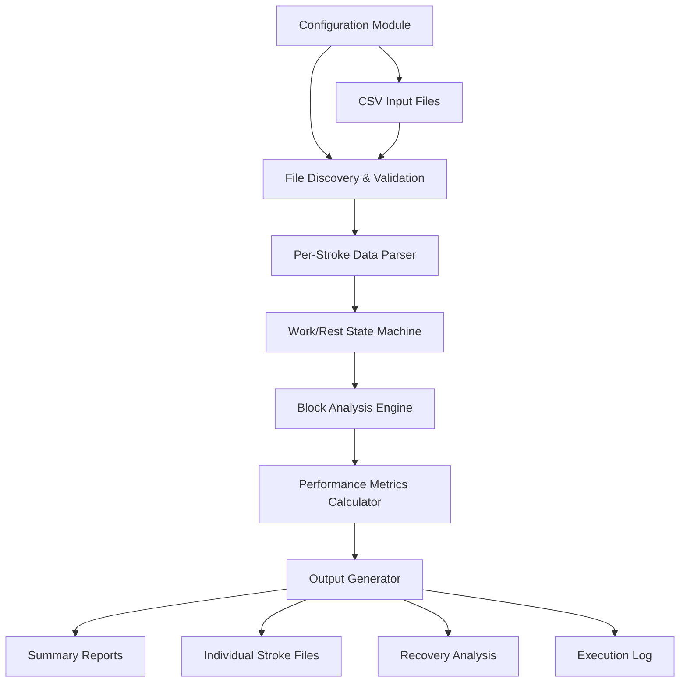

# Design Document

## Overview

The Rowing Performance Analyzer is implemented as a single PowerShell script that processes Speed Coach CSV exports through a pipeline architecture. The system uses state-based processing to identify work and rest periods, calculates performance metrics using configurable algorithms, and generates multiple output formats for comprehensive analysis.

The design emphasizes reliability, configurability, and detailed logging to support both automated batch processing and interactive analysis workflows.

## Architecture

### High-Level Architecture



### Processing Pipeline

The system follows a sequential processing model:

1. **Configuration Loading**: Loads and validates configuration from dedicated Config.ps1 module
2. **Input Discovery**: Scans input directory for CSV files
3. **File Processing**: Processes each CSV file independently
4. **Data Parsing**: Locates and parses per-stroke data sections
5. **State Classification**: Classifies each stroke as work or rest using configuration parameters
6. **Block Formation**: Groups consecutive work strokes into blocks
7. **Metrics Calculation**: Computes performance metrics for each block
8. **Output Generation**: Creates summary and detailed output files

## Components and Interfaces

### Core Components

#### 1. Configuration Manager
- **Purpose**: Manages all configurable parameters through a dedicated configuration module
- **Interface**: `RowingAnalyzerConfig` class with validation and factory functions
- **Implementation**: `Config.ps1` module with comprehensive parameter validation
- **Key Parameters**:
  - Heart rate work zone: `TargetMinHR`, `TargetMaxHR` (default: 124-138 BPM)
  - Stroke rate range: `MinWorkRate`, `MaxWorkRate` (default: 16-24 SPM)
  - Distance threshold: `MinBlockDist` (default: 500 meters)
  - DPS target: `TargetDPSThreshold` (default: 10.5 meters)
  - Efficiency bounds: `EffFloor`, `EffCeiling` (default: 0.020-0.035)
- **Features**:
  - Parameter validation with range checking
  - Default value management
  - Configuration documentation
  - Error handling with meaningful messages
  - File path construction and directory management

#### 2. CSV Parser
- **Purpose**: Extracts per-stroke data from Speed Coach CSV exports
- **Input**: Raw CSV file content
- **Output**: Structured stroke data objects
- **Key Functions**:
  - Locates "Per-Stroke Data:" section header
  - Identifies IMP sensor data columns
  - Handles missing values ("---") gracefully
  - Converts string data to appropriate numeric types

#### 3. Work/Rest Classifier
- **Purpose**: Determines whether each stroke represents work or rest
- **Algorithm**: Multi-criteria evaluation
  - Heart rate within target zone (124-138 BPM)
  - Stroke rate within work range (16-24 SPM)
  - Valid IMP distance measurement
- **State Management**: Tracks transitions between work and rest periods

#### 4. Block Analysis Engine
- **Purpose**: Groups work strokes into meaningful training blocks
- **Criteria**:
  - Minimum 10 consecutive work strokes
  - Minimum 500 meters total distance
- **Output**: Block-level aggregated metrics

#### 5. Performance Metrics Calculator
- **Purpose**: Computes rowing-specific performance indicators
- **Metrics**:
  - **Efficiency Score**: Normalized speed-to-heart rate ratio
  - **DPS Analysis**: Distance per stroke vs. target threshold
  - **Success Rate**: Percentage of strokes meeting DPS target
  - **Averages**: Heart rate, stroke rate, speed aggregation

#### 6. Recovery Analyzer
- **Purpose**: Analyzes heart rate recovery during rest periods
- **Criteria**:
  - Minimum 5 strokes in rest period
  - Minimum 30 seconds duration
  - Valid start and end heart rate values
- **Metrics**: Heart rate drop and recovery rate per minute

#### 7. Output Generator
- **Purpose**: Creates multiple output formats for different use cases
- **Outputs**:
  - **Block Summary**: Aggregated training block metrics
  - **Recovery Summary**: Heart rate recovery analysis
  - **Individual Strokes**: Detailed stroke-by-stroke data per session
  - **Execution Log**: Processing events and debug information

### Helper Functions

#### `Get-EffScore($speed, $hr)`
Calculates normalized efficiency score using configurable bounds:
```
rawEff = speed / heartRate
score = ((rawEff - effFloor) / (effCeiling - effFloor)) * 10
return bounded(score, 0, 10)
```

#### `Get-EffRating($score)`
Converts numeric efficiency scores to categorical ratings:
- Elite: 8.5+
- Strong: 6.5-8.4
- Good: 4.5-6.4
- Developing: <4.5

#### `Convert-TimeToSeconds($timeStr)`
Parses Speed Coach time formats into seconds:
- Supports HH:MM:SS.tenths format
- Supports MM:SS.tenths format
- Handles missing values gracefully

#### `Write-Log($message, $color)`
Provides structured logging with timestamps and color coding:
- Writes to both console and log file
- Supports severity-based color coding
- Includes timestamp for all entries

## Data Models

### Stroke Data Model
```powershell
@{
    ElapsedTime = "00:02:15.3"
    HeartRate = 132
    StrokeRate = 20.5
    Speed_IMP = 4.2
    Distance_IMP = 1250.5
    DPS_IMP = 10.8
    Power = 245
}
```

### Work Block Model
```powershell
@{
    Date = "SessionName"
    BlockNumber = 1
    AvgDPS = 10.65
    StrokesAtTarget = 45
    SuccessRate = "78.9%"
    EffScore = 7.2
    Rating = "Strong"
    AvgHR = 135
    AvgRate = 20.1
    Dist_m = 750
    Strokes = 57
}
```

### Individual Stroke Model
```powershell
@{
    Date = "SessionName"
    BlockNumber = 1
    StrokeNumber = 23
    ElapsedTime = "00:02:15.3"
    HeartRate = 132
    StrokeRate = 20.5
    Speed_IMP = 4.2
    Distance_IMP = 1250.5
    DPS_IMP = 10.8
    Power = 245
    AtTarget = "Yes"
}
```

### Recovery Model
```powershell
@{
    Date = "SessionName"
    StartHR = 142
    EndHR = 128
    HR_Drop = 14
    Recovery_Rate = 21.0  # BPM per minute
}
```

## Correctness Properties

*A property is a characteristic or behavior that should hold true across all valid executions of a system-essentially, a formal statement about what the system should do. Properties serve as the bridge between human-readable specifications and machine-verifiable correctness guarantees.*

### Property 1: CSV Parsing Robustness
*For any* valid Speed Coach CSV file, the parser should successfully locate the "Per-Stroke Data:" header and extract IMP sensor columns without errors, handling missing values marked as "---" gracefully
**Validates: Requirements 1.1, 1.2, 1.3**

### Property 2: Work Classification Accuracy  
*For any* stroke with heart rate (124-138 BPM), stroke rate (16-24 SPM), and valid IMP distance data, the system should classify it as work if and only if all three criteria are met simultaneously
**Validates: Requirements 2.1, 2.2, 2.3, 2.4**

### Property 3: Block Formation Consistency
*For any* sequence of work strokes, a work block should be created if and only if the sequence contains more than 10 strokes and covers at least 500 meters total distance
**Validates: Requirements 2.5, 2.6**

### Property 4: Efficiency Score Calculation
*For any* valid speed and heart rate values, the efficiency score calculation should use the formula ((speed/hr - floor)/(ceiling-floor)) * 10 and bound the result between 0 and 10
**Validates: Requirements 3.1, 3.2**

### Property 5: Rating Classification Consistency
*For any* efficiency score, the rating should be assigned as Elite (8.5+), Strong (6.5-8.4), Good (4.5-6.4), or Developing (<4.5)
**Validates: Requirements 3.3**

### Property 6: DPS Target Evaluation
*For any* stroke with distance per stroke data, the system should correctly compare against the 10.5 meter threshold and mark achievement status
**Validates: Requirements 3.4, 4.2**

### Property 7: Missing Value Handling
*For any* dataset containing missing values marked as "---", average calculations should exclude these values and produce correct results
**Validates: Requirements 3.5**

### Property 8: Stroke Detail Capture
*For any* work block, the system should capture complete stroke details including stroke number, heart rate, stroke rate, speed, distance, and DPS for each stroke
**Validates: Requirements 4.1**

### Property 9: File Generation Per Session
*For any* input session, the system should create a separate stroke detail CSV file using the format "[SessionName]_Stroke_Details.csv" with proper headers
**Validates: Requirements 4.3, 4.4, 4.5**

### Property 10: Recovery Analysis Criteria
*For any* rest period with more than 5 strokes and duration exceeding 30 seconds, the system should calculate heart rate drop and recovery rate using the formula (start_HR - end_HR) / duration_minutes
**Validates: Requirements 5.1, 5.2, 5.3, 5.5**

### Property 11: Summary Report Completeness
*For any* generated work summary, it should include all required block-level metrics (average DPS, strokes at target, success rate, efficiency score, distance) and configuration parameters in headers, sorted by date in descending order
**Validates: Requirements 6.1, 6.2, 6.3**

### Property 12: Error Logging Consistency
*For any* error that occurs during processing, the system should log detailed error messages including file name and exception details with timestamps and appropriate severity levels
**Validates: Requirements 7.2, 7.3**

### Property 13: Validation Verification
*For any* processing run, the system should perform validation checks on output file creation and log the results
**Validates: Requirements 7.5**

### Property 14: Path Construction Reliability
*For any* execution environment, the system should construct file paths using the current user's environment variable and handle non-existent output directories by creating them automatically
**Validates: Requirements 9.1, 9.4**

## Error Handling

### Error Categories

1. **File System Errors**
   - Missing input directory
   - Insufficient permissions
   - Disk space limitations
   - File corruption

2. **Data Format Errors**
   - Invalid CSV structure
   - Missing required columns
   - Unexpected data types
   - Encoding issues

3. **Processing Errors**
   - Mathematical calculation failures
   - Memory limitations
   - Timeout conditions

### Error Handling Strategy

- **Graceful Degradation**: Continue processing other files when one file fails
- **Detailed Logging**: Capture full exception details and context
- **User Feedback**: Provide clear error messages and suggested actions
- **Recovery Mechanisms**: Attempt to process partial data when possible

### Logging Framework

The system implements a comprehensive logging framework with:
- **Timestamped Entries**: All log entries include precise timestamps
- **Severity Levels**: Color-coded output for different message types
- **Dual Output**: Messages written to both console and log file
- **Structured Format**: Consistent message formatting for parsing

## Testing Strategy

### Dual Testing Approach

The system requires both unit testing and property-based testing for comprehensive coverage:

**Unit Tests:**
- Verify specific examples and edge cases
- Test integration points between components  
- Validate error conditions and boundary cases
- Focus on concrete scenarios with known inputs and outputs

**Property-Based Tests:**
- Verify universal properties across all inputs
- Use randomized input generation for comprehensive coverage
- Test mathematical calculations with varied parameters
- Validate data processing pipelines with diverse datasets

### Property Test Configuration

- **Minimum 100 iterations** per property test due to randomization
- **Test Framework**: Pester with custom property test generators
- **Tag Format**: **Feature: rowing-performance-analyzer, Property {number}: {property_text}**
- Each correctness property implemented by a single property-based test

### Test Data Generation

**CSV Generator**: Creates valid Speed Coach CSV files with:
- Randomized stroke data within realistic ranges
- Configurable work/rest patterns
- Missing value injection ("---" patterns)
- Various session lengths and intensities

**Stroke Generator**: Produces individual stroke records with:
- Heart rate: 60-180 BPM range
- Stroke rate: 10-40 SPM range  
- Distance: Cumulative realistic progression
- Speed: Calculated from distance and time
- Missing value patterns for robustness testing

### Integration Testing

- **End-to-End Workflows**: Complete CSV processing pipelines
- **Multi-File Processing**: Batch processing validation
- **Output Verification**: Generated file content validation
- **Performance Testing**: Large dataset processing validation